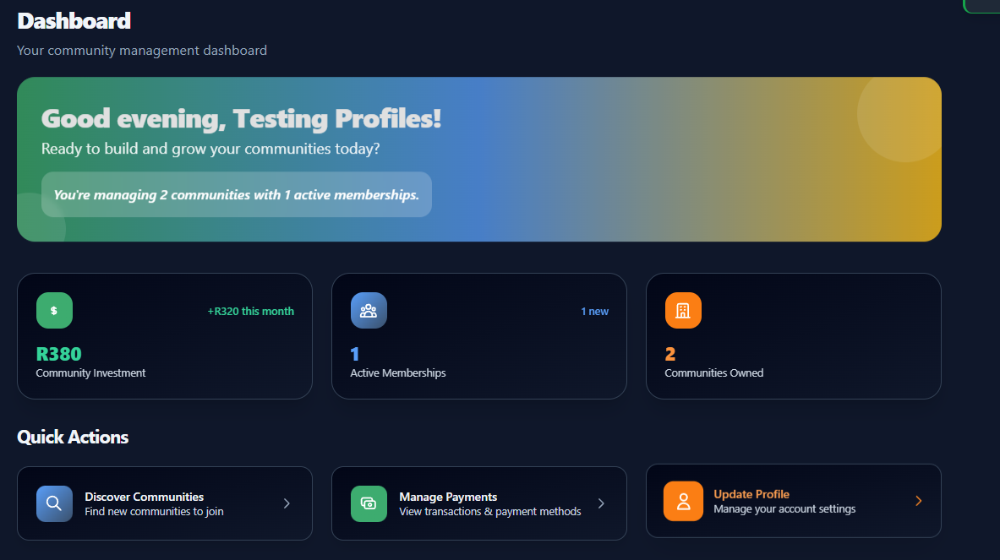
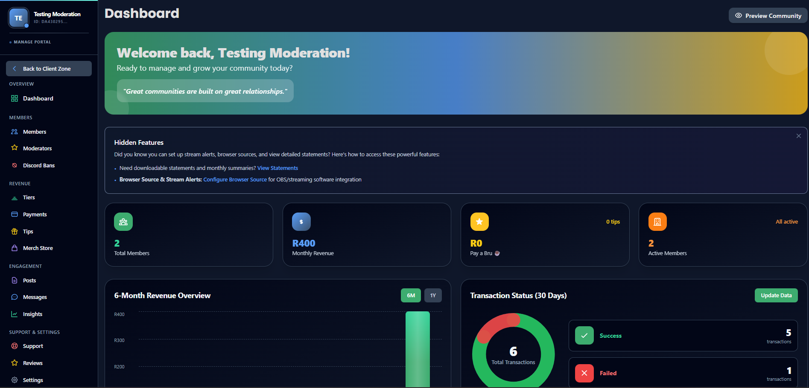
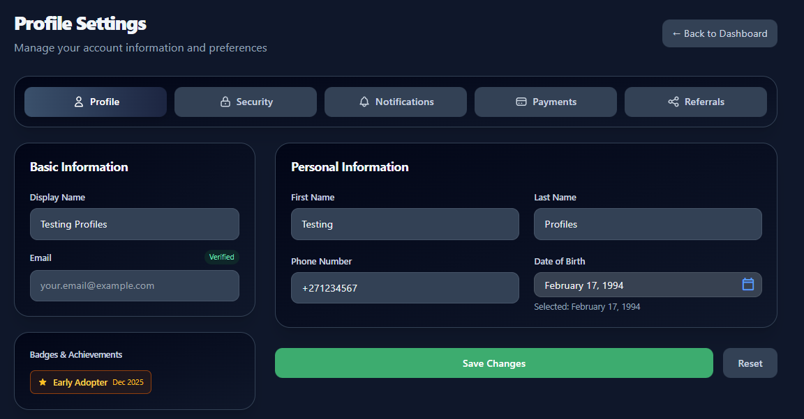

# PayBru

**Modern Community Membership Platform**

*Empowering creators and communities with seamless membership management*

[Features](#-features) • [Preview](#-platform-preview) • [How It Works](#-how-it-works) • [FAQ](#-faq) • [Contact](#-contact)

---

## 🎯 What is PayBru?

PayBru is a membership and subscription platform that helps creators, organizations, and communities build sustainable revenue through tiered memberships, flexible subscriptions, and community engagement tools.

---

## ✨ Features

<table>
<tr>
<td width="50%" valign="top">

### For Creators
- 💎 Flexible Membership Tiers
- 💰 Revenue Management
- 📊 Analytics Dashboard
- 🎮 Discord Integration
- 🧾 Financial Reports

</td>
<td width="50%" valign="top">

### For Members
- 🔐 Secure Payments
- 📅 Flexible Subscriptions
- 🎁 Tips & Contributions
- 🔔 Notifications
- 📱 Mobile Friendly

</td>
</tr>
</table>

<b>View all features →</b>

### Platform Benefits
- 🏘️ **Multi-Community** - Host and manage multiple communities
- ⚡ **Automated Processing** - Set it and forget it with automatic renewals
- 🎨 **Customizable** - Brand your community with custom themes and logos
- 🔒 **Secure & Reliable** - Built with enterprise-grade security

📄 [Full Feature List](docs/FEATURES.md)

---

## 📸 Platform Preview

<b>Member Dashboard</b>

 

*Track your community investments, memberships, and quick actions*

<b>Creator Dashboard</b>

 

*Revenue analytics, transaction monitoring, and community management*

<b>Profile & Settings</b>

 

*Manage your account with badges and achievements*

---

## 📖 How It Works

<b>View detailed flows (Payment, Onboarding) →</b>

📄 [Full Documentation](docs/HOW-IT-WORKS.md)

---

## ❓ FAQ

<b>How do I get started as a creator?</b>

Contact us at hello@paybru.co.za or visit [paybru.co.za](https://paybru.co.za) to set up your community.

<b>What payment methods are supported?</b>

We support secure payment processing through industry-standard payment gateways with South African payment support.

<b>Is my data secure?</b>

Yes! We use enterprise-grade encryption, regular security audits, and comply with GDPR and PCI DSS standards.

📄 [More FAQs](docs/FAQ.md)

---

## 🔒 Security & Compliance

<table>
<tr>
<td>🔐 Enterprise Encryption</td>
<td>✅ Secure Payments</td>
<td>🛡️ Regular Audits</td>
<td>🔒 GDPR Compliant</td>
<td>💳 PCI DSS</td>
</tr>
</table>

---

## 📞 Contact

<table>
<tr>
<td>📧 <b>General</b> hello@paybru.co.za</td>
<td>🆘 <b>Support</b> support@paybru.co.za</td>
<td>🤝 <b>Partnerships</b> partnerships@paybru.co.za</td>
<td>🌐 <b>Website</b> <a href="https://paybru.co.za">paybru.co.za</a></td>
</tr>
</table>

---

**Built with ❤️ for creators and communities**

*Empowering sustainable creator economies*

