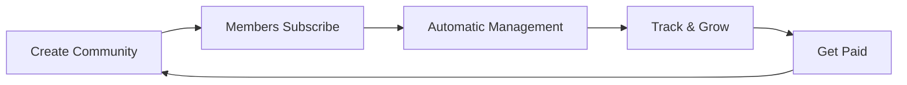

# 👋 Welcome to PayBru

### Modern Community Membership Platform

*Empowering creators and communities with seamless membership management*

---

## 🎯 What We Do

PayBru is a membership and subscription platform that helps **creators**, **organizations**, and **communities** build sustainable revenue through tiered memberships, flexible subscriptions, and community engagement tools.

## ✨ Platform Highlights

<table>
<tr>
<td width="50%" valign="top">

### 💎 For Creators
- **Flexible Membership Tiers** with custom benefits
- **Revenue Management** with transparent payouts
- **Real-time Analytics** for growth insights
- **Discord Integration** for automated role management
- **Financial Reports** with automated tax documents

</td>
<td width="50%" valign="top">

### 🌟 For Members
- **Secure Payment Processing** you can trust
- **Flexible Billing** (monthly, quarterly, annual)
- **Creator Support** via tips and contributions
- **Stay Connected** with update notifications
- **Mobile Accessible** from anywhere

</td>
</tr>
</table>

## 🛠️ Technology Stack

Built with modern, enterprise-grade technologies:

- **.NET 9.0** - Latest Microsoft framework for performance and reliability
- **Blazor** - Modern web UI framework for responsive interfaces
- **SQL Server** - Enterprise database for data integrity
- **Secure Payment Processing** - Industry-standard gateway integration

## 🚀 Get Started

### 🎨 Launch Your Community
Ready to start your membership community? Get in touch:
- 📧 **General Inquiries**: hello@paybru.co.za
- 🤝 **Partnerships**: partnerships@paybru.co.za
- 🌐 **Website**: [paybru.co.za](https://paybru.co.za)

### 👨‍💻 For Developers
Interested in integrations or partnerships? We'd love to collaborate! Reach out to our team.

## 🔒 Security & Trust

We take security seriously with:
- 🔐 Enterprise-grade encryption
- ✅ Secure payment processing
- 🛡️ Regular security audits
- 🔒 GDPR compliant
- 💳 PCI DSS standards adherence

> 🔐 **Found a security issue?** Please report responsibly to security@paybru.co.za

## 📊 How It Works

1. **Create Your Community** - Set up your branded space with custom tiers
2. **Members Subscribe** - Supporters choose their membership level
3. **Automatic Management** - We handle payments, renewals, and notifications
4. **Track & Grow** - Use analytics to understand your community
5. **Get Paid** - Receive regular payouts with full transparency

## 🤝 Let's Connect

| Contact | Email |
|---------|-------|
| 💬 General | hello@paybru.co.za |
| 🆘 Support | support@paybru.co.za |
| 🤝 Partnerships | partnerships@paybru.co.za |
| 🔒 Security | security@paybru.co.za |

---

**Built with ❤️ for creators and communities**

*Empowering sustainable creator economies*

[🌐 paybru.co.za](https://paybru.co.za)

